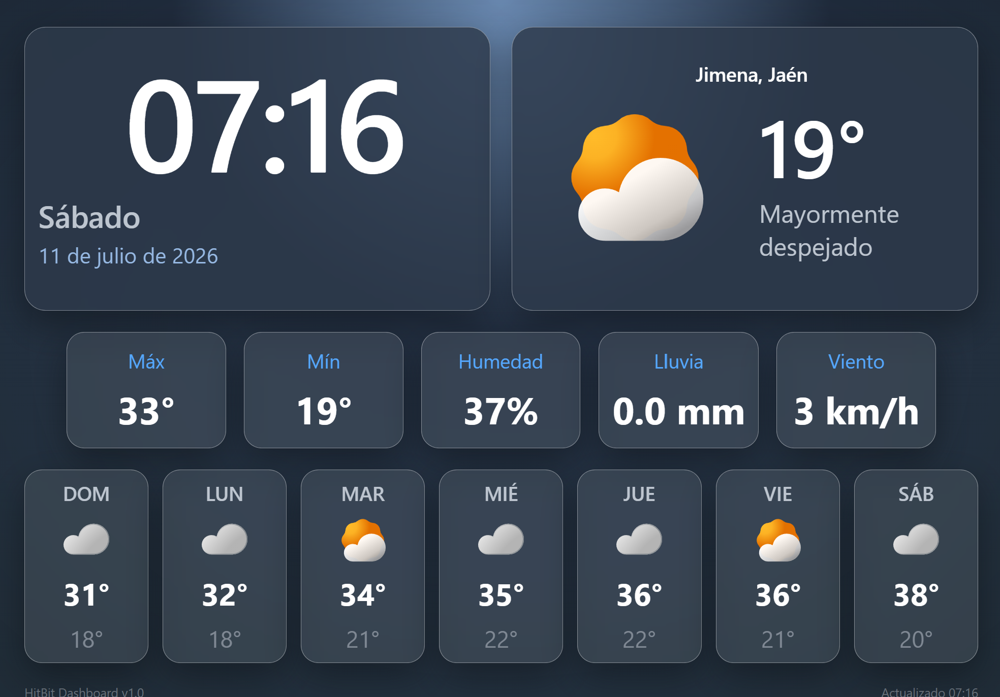

# Clock Dashboard

Dashboard meteorológico minimalista diseñado para reutilizar una antigua tablet Android como reloj y estación meteorológica permanente.

El proyecto está desarrollado únicamente con **HTML5, CSS3 y JavaScript**, sin librerías externas, para conseguir el máximo rendimiento en dispositivos con recursos limitados, como tablets con Android 6 ejecutando **Fully Kiosk Browser**.

## Características

- Reloj digital de gran tamaño.
- Fecha completa en español.
- Temperatura actual e icono meteorológico.
- Estado del cielo.
- Temperatura máxima y mínima del día.
- Humedad, lluvia y velocidad del viento.
- Pronóstico para los próximos 7 días.
- Actualización automática mediante la API de Open-Meteo.
- Diseño minimalista optimizado para pantalla horizontal.

El objetivo del proyecto es ofrecer una interfaz limpia, elegante y fácil de leer desde varios metros de distancia, con un consumo mínimo de CPU y memoria para funcionar de forma continua las 24 horas del día.

